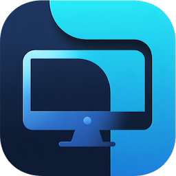

#  Screen Viewer

Screen Viewer is a Windows desktop tool (Go + Walk) that mirrors one monitor inside a resizable control window and can also throw still images fullscreen onto the selected display.

I created this for personal use, I play table top RPGs like Pathfinder and D&D.  I have a monitor facing the players and show pictures of the NPCs, monsters and other notable things on the second monitor, but since I couldn't see the monitor I ended up dragging pictures to somewhere I can't see or creating a power point and using it to display the images.  This was all a bit clunky so I wrote this app.

## What It Does

- Captures the selected display continuously and shows an aspect-correct live preview.
- Starts on Display 2 when available (otherwise Display 1).
- Keeps the preview window locked to the selected display's aspect ratio while resizing.
- Supports Always-on-top mode for the control window.
- Supports dropping image files onto the control window to show them fullscreen on the selected display.
- Supports pasting an image from the clipboard (`Ctrl+V`) to show it fullscreen on the selected display.
- Includes a toggleable Image Browser panel for selecting and launching images from a folder.

## Menus And Controls

### File

- `File > Exit`: Close the app.

### Edit

- `Edit > Paste` (`Ctrl+V`): Paste an image from the clipboard and display it fullscreen on the selected monitor.

### View

- `Always on top`: Keep the control window above other windows.
- `Allow multiple images`: Toggle single-image or multi-image mode. When enabled, you can display up to 9 images simultaneously in a tiled grid on the fullscreen display. When disabled (default), only one image displays at a time.
- `Image browser`: Show/hide the left browser panel.
- `Display N (...)`: Switch the monitored/target display.

## Ways To Show An Image Fullscreen

You can place an image on the selected display in four ways:

1. Drag an image file onto the main Screen Viewer window.
2. Open `View > Image browser`, choose a folder, then single-click an image in the list.
3. Copy an image from another app and press `Ctrl+V` (or use `Edit > Paste`).
4. Right-click any image in Google Chrome and select **Send to ScreenViewer** (requires the Chrome extension — see [Chrome Extension](#chrome-extension)).

Supported file extensions for drag/browser are:

- `.png`
- `.jpg`
- `.jpeg`
- `.gif`
- `.bmp`
- `.webp`

## Fullscreen Image Behavior

**Single-image mode (default):**
- The fullscreen image is shown in a borderless window on the selected display and is raised above regular windows when opened.
- The image is scaled to fit while preserving aspect ratio and letterboxing as needed.
- Click on the fullscreen image (left/right/middle) to close it, or press any key while the fullscreen window has focus.
- While active, the main preview shows a bottom-right thumbnail card with a red `X` close button.

**Multi-image mode** (when "Allow multiple images" is enabled):
- Up to 9 images can be displayed simultaneously in a tiled grid layout on the fullscreen display.
- Grid layouts adapt to the number of images: 1 image (1×1), 2 images (2×1), 3-4 images (2×2), 5-6 images (3×2), 7-8 images (4×2), 9 images (3×3).
- Each image is scaled to fit its grid section while preserving aspect ratio.
- The main preview shows thumbnail cards for all active images in a right-aligned strip at the bottom, dynamically scaled to fit available window width.
- Each thumbnail has a red `X` close button to remove that specific image.
- Adding a duplicate image removes the old copy and shows the new one (refreshing its position).
- When the limit of 9 images is reached, adding another image removes the oldest one (FIFO eviction).
- Click on any image in the fullscreen grid to close it, or press any key to close all images.

## Image Browser Panel

- Hidden by default; toggle with `View > Image browser`.
- "Browse Folder..." opens a folder picker.
- Lists detected image files in that folder.
- Single-clicking an item immediately opens it fullscreen on the selected display.

## Chrome Extension

ScreenViewer includes a Chrome extension that adds a **Send to ScreenViewer** option to the browser's right-click context menu for images.

### Installation

1. Download `screenviewer-extension.zip` from the [latest release](../../releases/latest) on GitHub.
2. Unzip it to a permanent folder (e.g. `C:\Tools\screenviewer-extension\`). Chrome loads the extension directly from this folder, so don't delete it after installing.
3. Open Chrome and go to `chrome://extensions/`.
4. Enable **Developer mode** using the toggle in the top-right corner.
5. Click **Load unpacked** and select the folder you unzipped in step 2.

The extension is now installed. To update, download the new zip from the release page, overwrite the files in your folder, and click the refresh icon on the extension card in `chrome://extensions/`.

### Usage

1. Start ScreenViewer
2. Right-click any image on a web page.
3. Select **Send to ScreenViewer** from the context menu.
4. The image appears on the selected display immediately.

The extension icon shows a green **✓** on success or a red **✗** on failure. Check the extension's service worker console (`chrome://extensions/` → Details → Inspect views: service worker) for error details.

### Notes

- ScreenViewer must be running before you send an image.
- The image observes the same single/multi-image mode setting as any other add method.
- If port 8765 is already in use by another application, change `const httpPort` in `app/http.go` and `const SCREENVIEWER_PORT` in `chrome-extension/background.js` to match.

## Native Resource Notes

The Windows UI behavior depends on embedded resources in `resources/windows/screenviewer.manifest` and `resources/windows/rsrc.syso`.
`build.bat` stages `rsrc.syso` into the module root for linking, builds `screenviewer.exe`, then removes the staged copy.

## Requirements

- Windows with at least two active displays
- Go 1.24+

## Run

```powershell
go run .
```

## Build

```powershell
build.bat
```

This produces two artifacts:

- `screenviewer.exe` — the main application
- `screenviewer-extension.zip` — the Chrome extension (see [Chrome Extension](#chrome-extension) above)